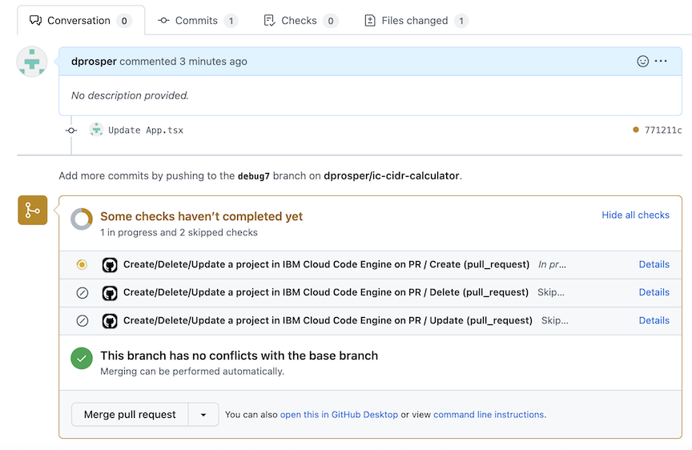
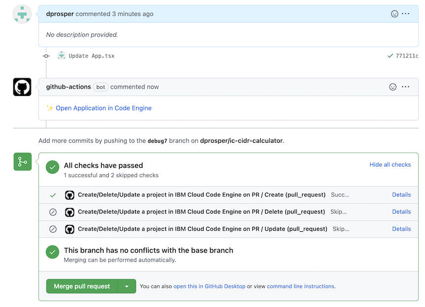
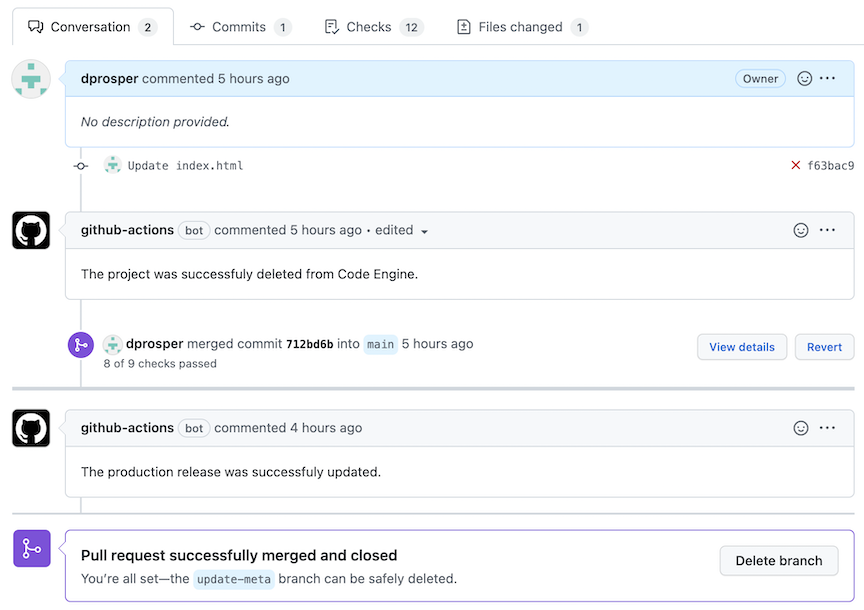
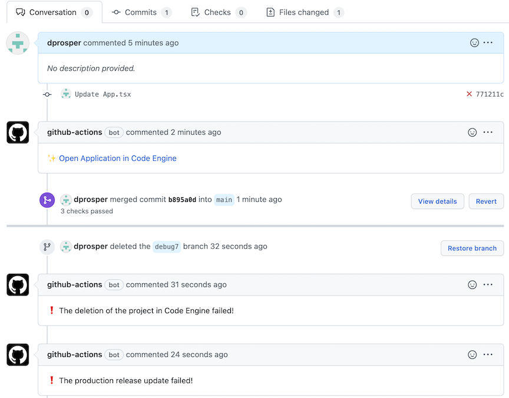

## Example workflow that uses GitHub Actions to deploy from source code to [Code Engine](https://cloud.ibm.com/codeengine).

#### Create a project in Code Engine workflow

This example will build a new image from the source, create a project in Code Engine and deploy an app.   naming the project/app based on the pull request sha. It does the following:

- Builds a new image and tags it with the sha from the PR
- Create a project and an app naimg themn based on the sha from the PR
- Deploy the app and insert the URL to the deployed app in a comment of the PR

The action can take additional input from a `json` file located in the same directory as the workflow file.  If a the `icce-project-config.json` is found it is processed, currently it supports creating configmaps only.  

```yml
      - name: Build and push image
        uses: docker/build-push-action@v2.8.0
        with:
          context: ./
          file: ./frontend-api/Dockerfile
          platforms: linux/amd64
          push: true
          tags:  ${{ env.REGISTRY_ORG_NAMESPACE }}/${{ env.REGISTRY_REPOSITORY }}:${{ github.event.pull_request.head.sha }}
          labels: ${{ steps.meta.outputs.labels }}

      - name: Deploy to IBM Cloud Code Engine
        uses: dprosper/icce-cud-cli@v0.2.0
        with:
          IMAGE: ${{ env.REGISTRY_ORG_NAMESPACE }}/${{ env.REGISTRY_REPOSITORY }}:${{ github.event.pull_request.head.sha }}
          REGISTRY_USER: ${{ secrets.DOCKERHUB_USER }}
          REGISTRY_PASSWORD: ${{ secrets.DOCKERHUB_TOKEN }}
          CE_ACTION: create
          CE_PROJECT_NAME: project-${{ github.event.pull_request.head.sha }}
          CE_APP_NAME: app-${{ github.event.pull_request.head.sha }}
```




- At completion of the run a link to the application is added to the PR so that it can be used for testing.




#### Delete a project in Code Engine workflow

This example will delete a project in Code Engine.  On delete failures it will create a comment inside the PR and it will generate an issue.  

```yml
      - name: Delete from IBM Cloud Code Engine
        uses: dprosper/icce-cud-cli@v0.2.0
        with:
          ISSUE_NUMBER: ${{ github.event.pull_request.number }}
          CE_PROJECT_NAME: project-${{ github.event.pull_request.head.sha }}
          CE_ACTION: delete
```



#### Update a project in Code Engine workflow

This example will update a project in Code Engine.  It does the following: 
- Tags the container image that was previously tagged with the sha from the PR with the latest tag. 
- Updates the application specified with the latest image. 

On update failures it will create a comment inside the PR and it will generate an issue. You can use this for example to update a production application after the PR is merged. 

```yml
      - name: Update in IBM Cloud Code Engine
        uses: dprosper/icce-cud-cli@v0.2.0
        with:
          CE_PROJECT_NAME: project-production
          CE_APP_NAME: app-production
          IMAGE: ${{ env.REGISTRY_ORG_NAMESPACE }}/${{ env.REGISTRY_REPOSITORY }}:latest
          CE_ACTION: update
```


